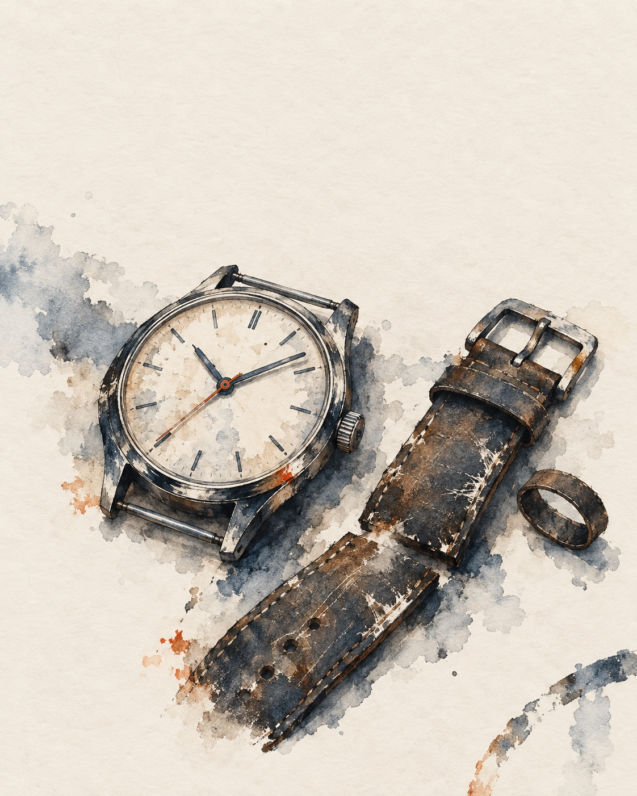
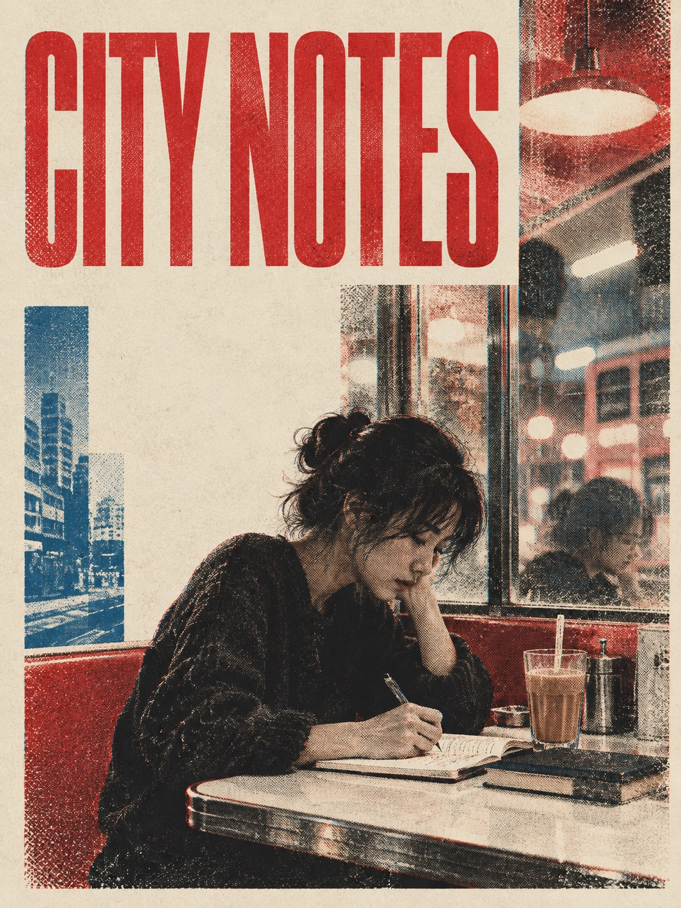
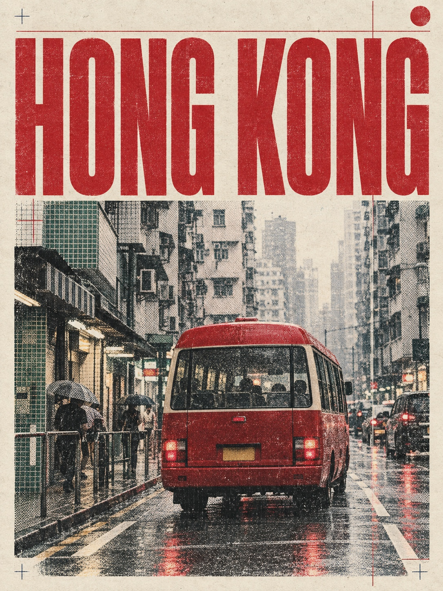
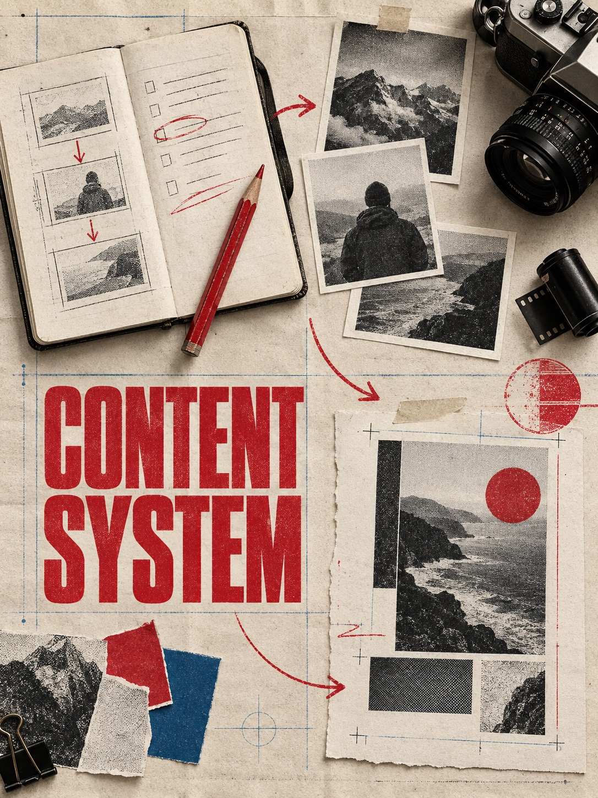
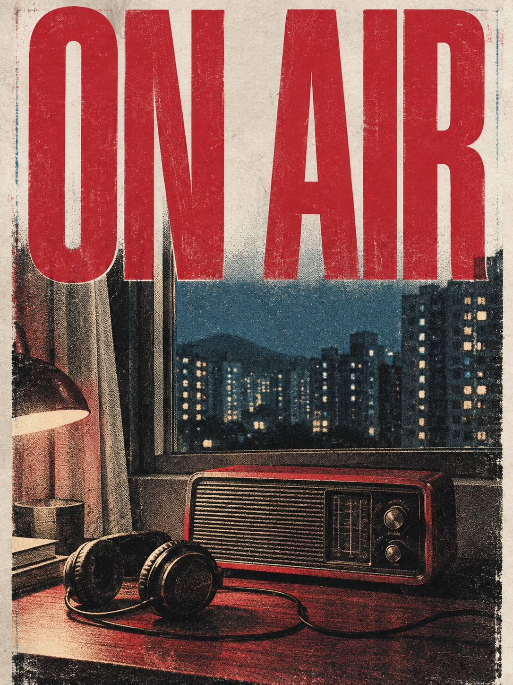
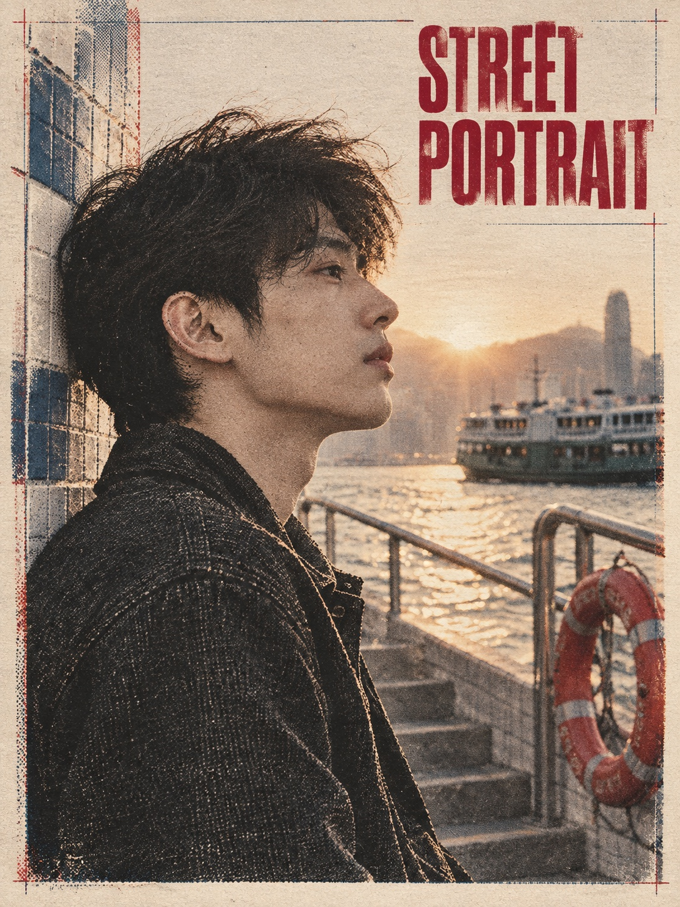
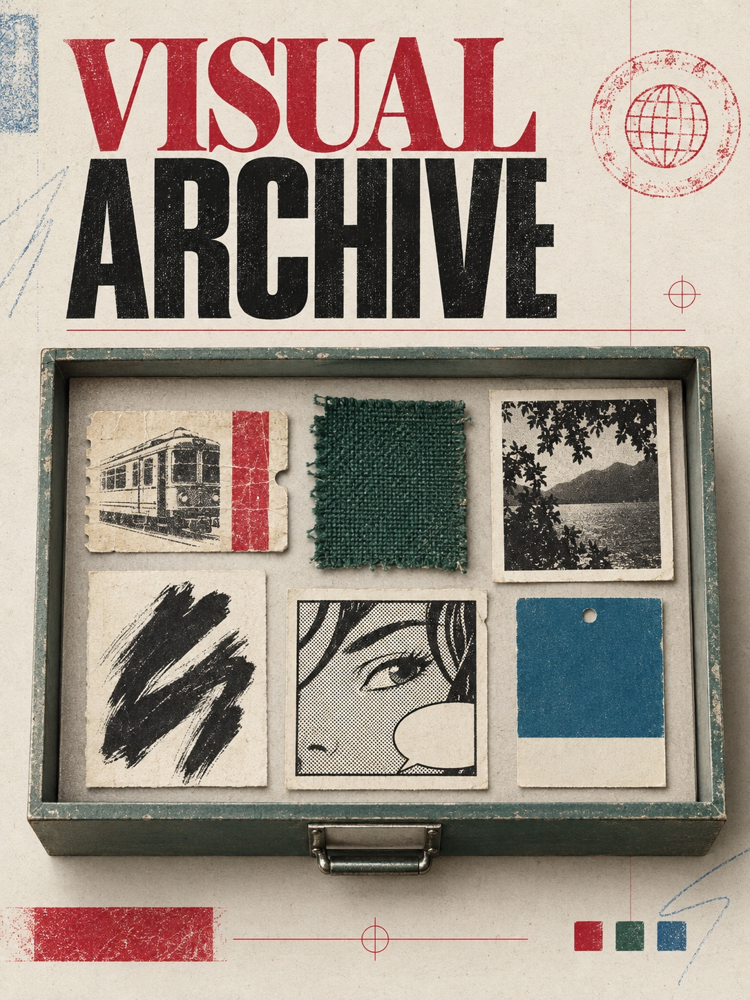
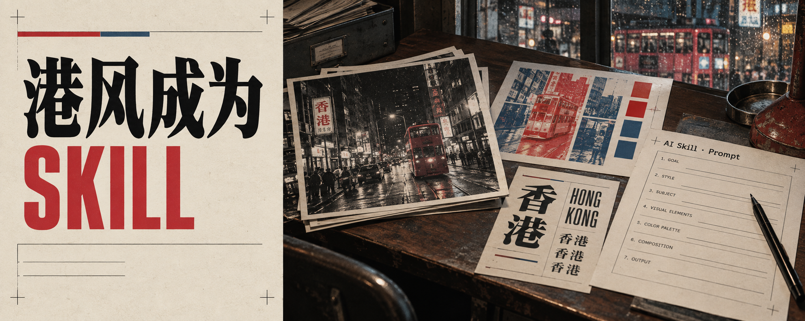

# laopai-skill

把可观察的视觉语言整理为可安装、可复用、可持续扩展的 Agent Skills。

目前包含两套可独立安装的视觉 Skill：

- **纸隙墨潮 / Paper-Gap Ink-Tide**：以裸露暖纸、开放回找线、断裂蓝黑墨块和局部湿水色构成的纸本混合媒介插画。适合人物、动物、场景、静物和抽象概念。
- **Hong Kong Editorial / 港式编辑视觉**：面向文章封面、小红书卡片、正文配图与街头自拍的港式编辑系统，强调构图、光线、印刷材料、开源字体与少字策略。

设计参考只用于提炼构图、字形气质、色彩与材料规则，不会作为素材上传或被逐图复刻。字体建议采用官方许可证可核验的白名单；未知招牌字、品牌定制字和来源不明的“免费字体”不会被自动用于商业输出。

## 当前能力

- `landscape-cover`：横版文章、公众号或 X 封面；默认 16:9，X 用 5:2。
- `xiaohongshu-card`：3:4 小红书封面或卡片。
- `article-illustration`：16:9 正文场景图。
- `selfie`：4:5 港风自拍与街头人像。
- `paper-ink-fragment-style`：将裸纸、开放回找线、断裂蓝黑墨块和局部湿水色迁移到全新主体；装饰痕迹为可选变量，不复用固定纹样词库。

## 安装

将仓库中的 `skills/laopai-visual` 或 `skills/paper-ink-fragment-style` 作为 Skill 安装到支持 Agent Skills 的工具中。安装后用：

```text
Use $laopai-visual to create a Hong Kong editorial cover for this article.
```

在 Codex 中，也可以把以下内容直接发给 Agent：

```text
请从这个 GitHub 仓库安装 Skill：
https://github.com/patrickpp0826/laopai-skill

Skill 路径：skills/laopai-visual
```

## 快速示例

```text
用 $paper-ink-fragment-style 画一只站在旧窗台上的黑猫。
画幅 4:5，青蓝点缀，装饰痕迹模式 none。
直接生成图片。
```

只需要提示词时：

```text
用 $paper-ink-fragment-style 为“在逆流中重新选择方向”生成生图提示词。
不要生成图片；输出英文正向提示词、英文负向提示词和中文核对稿。
```

```text
用 $laopai-visual 生成一张 3:4 小红书卡片：
标题：港风不是滤镜
副标题：它是一套视觉系统
风格：hong-kong-editorial
```

```text
用 $laopai-visual 为这篇长文生成：
1 张 5:2 横版封面；
3 张 16:9 正文配图。
统一色板与材质，每张独立构图，正文图尽量无字。
```

## 纸隙墨潮 · Visual references

| 01 · 银发肖像 | 02 · 窗边黑猫 | 03 · 雨中的码头 |
| --- | --- | --- |
|  |  |  |
| 04 · 腕表习作 | 05 · 早餐时刻 | 06 · 逆流的选择 |
|  |  |  |

六张图覆盖人物、动物、环境、静物、生活叙事与抽象概念。它们共享纸白、开放线、断裂墨块和湿水色反应，但不复用固定装饰符号。生成设定和完整提示词见 [`examples/paper-ink-showcase-2026-09/`](examples/paper-ink-showcase-2026-09/)。

## 港式编辑视觉 · Visual references

| 01 · City Notes | 02 · Hong Kong | 03 · Content System |
| --- | --- | --- |
|  |  |  |
| 04 · On Air | 05 · Street Portrait | 06 · Visual Archive |
|  |  |  |

这组 3:4 海报展示了 `hong-kong-editorial` 在城市写作、街景、内容工作流、播客封面、人物摄影和风格档案六种场景中的表现。每张图的完整提示词收录在 [`examples/showcase-2026-09/prompts/`](examples/showcase-2026-09/prompts/)。

风格规则用于保持视觉语言一致，不用于逐张复刻示例图。

### 其他比例

| 长文横版封面 | 正文叙事配图 |
| --- | --- |
|  |  |

## 风格库

| 风格 | ID | 适合内容 |
| --- | --- | --- |
| 港式编辑视觉 | `hong-kong-editorial` | 港风封面、小红书卡片、文章配图、夜街人像 |
| 纸隙墨潮 | `paper-ink-fragment-v2.1` | 人物、动物、场景、静物与抽象概念的纸本混合媒介插画 |

未来每个风格都独立放在 `styles/{style-id}/` 下，包含：

- `META.md`：适用对象、输出形状、约束与选择依据。
- `STYLE.md`：可复用的视觉原子。

这样可以继续加入漫画、插画、印刷或摄影风格，而不会把所有规则混进一条大提示词。

## 新增风格的原则

请提取可观察、可描述的视觉特征：线条、构图、叙事、色彩、材质、空间、排版与禁用项。

不要以复制在世艺术家的单一作品为目标，也不要把艺术家姓名当成提示词捷径。请把参考转译成原创、可复用的设计语言。详见 [CONTRIBUTING_STYLES.md](CONTRIBUTING_STYLES.md)。

## 目录

```text
laopai-skill/
├── skills/
│   ├── paper-ink-fragment-style/  # 纸隙墨潮生图配方
│   └── laopai-visual/              # 港式编辑视觉工作流
├── styles/                     # 港式编辑风格原子
│   └── hong-kong-editorial/
├── examples/
│   ├── paper-ink-showcase-2026-09/ # 纸隙墨潮样图与提示词
│   └── showcase-2026-09/           # 港式编辑样图与提示词
└── CONTRIBUTING_STYLES.md
```

## 致谢

本仓库的“输出形状 + 风格原子 + 完整提示词”组织思路受到 [Punk-Skill](https://github.com/adrianpunk/Punk-Skill) 启发。本仓库未复制其具体风格文件、提示词正文或视觉素材。

## 许可证

MIT License。生成图片、用户上传图片与第三方参考素材的权利由相应创作者、用户和图像服务条款决定。

字体另按各自上游许可证执行，详见 [`font-licensing.md`](skills/laopai-visual/references/font-licensing.md)。参考素材处理规则见 [`reference-material-policy.md`](skills/laopai-visual/references/reference-material-policy.md)。
